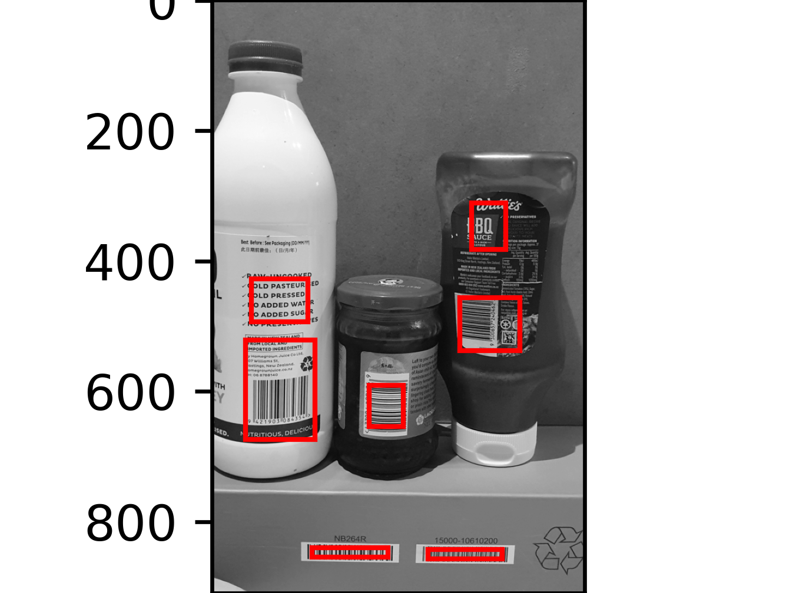
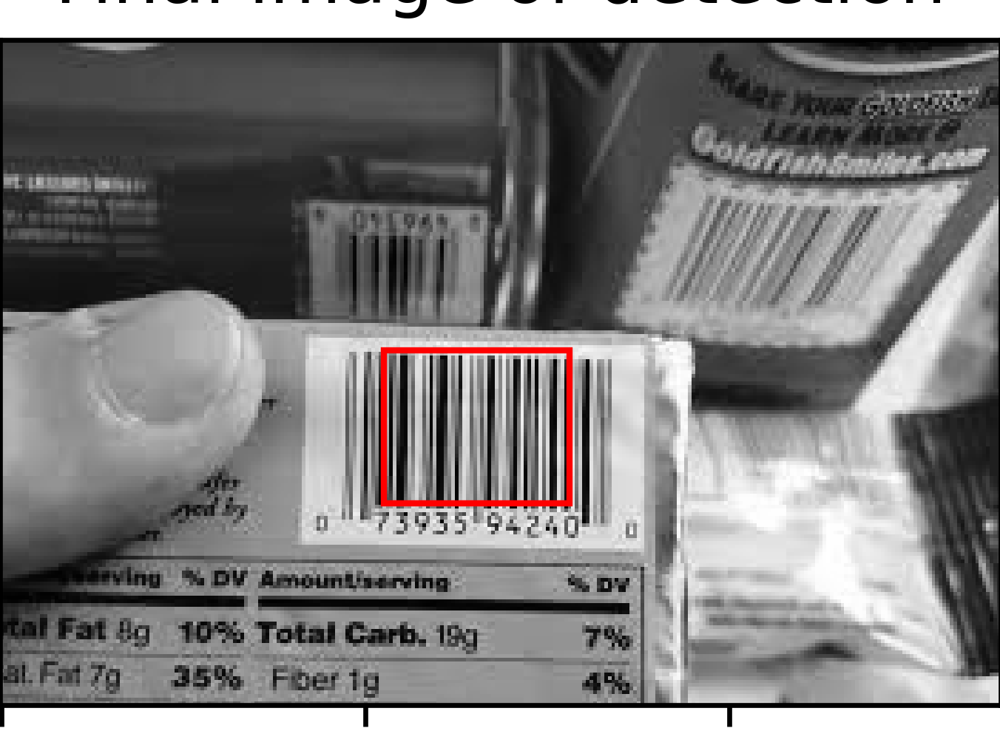
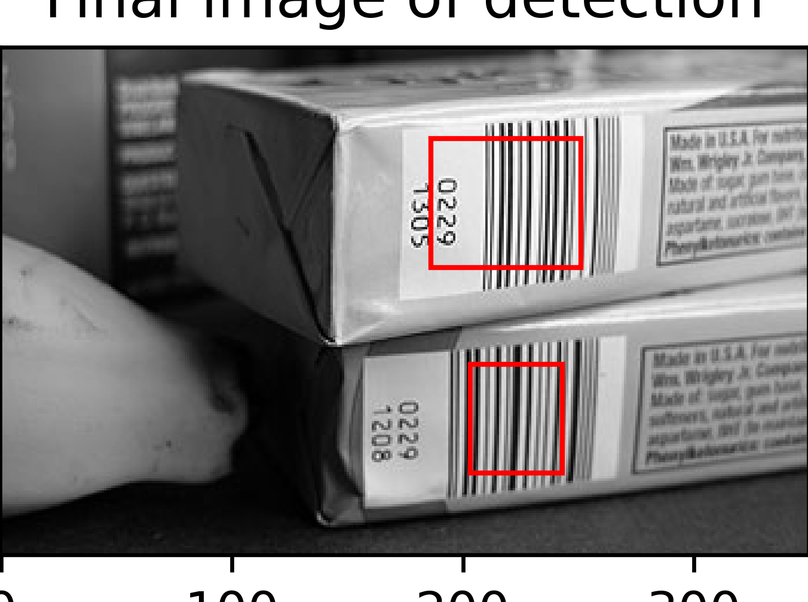
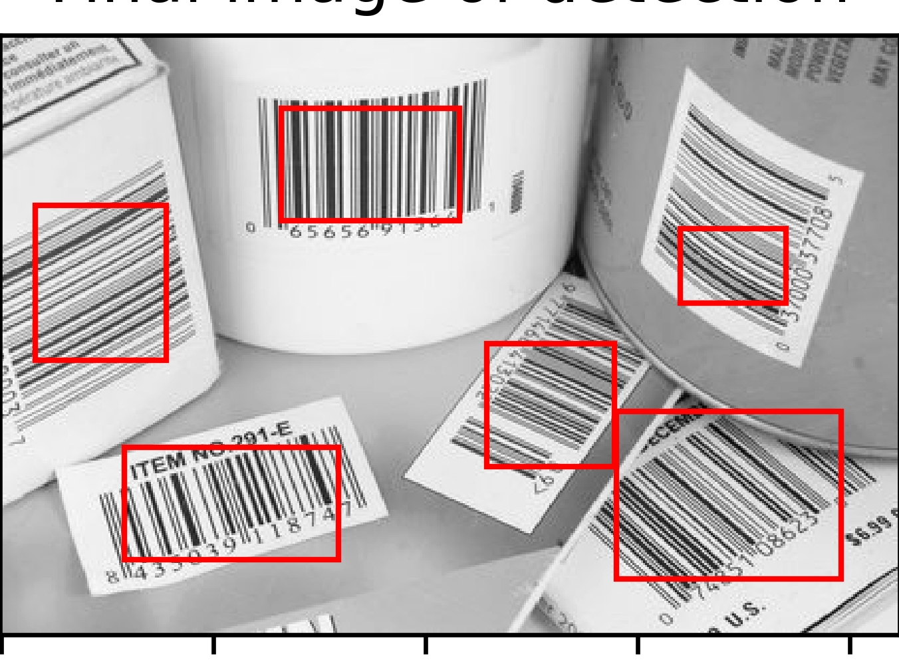

# Extension Report
## Name: Helen Lu, UPI: hlu750

For my extension of the barcode detection algorithm, I decided to modify my algorithm to be capable of detecting multiple barcodes within an image with multiple barcodes on products instead of limiting the detection to a single barcode per image.

I created a separate python file named “CS373_extension.py” where I used my code from the main component of the assignment, CS373_barcode_detection.py, and built code on top of that. I focused my attention on modifying my compute boundary box function and display steps because the functions that aided in detecting a barcode would remain the same and I would be applying them iteratively to detect multiple barcodes. 

I implemented a loop to iterate over the connected components and compute their boundary boxes multiple times.
The loop iterate over the total number of components. 

We can see that the algorithm can detect all the connected components which may be a potential barcode. However where the algorithm fails is in detecting non barcodes. ALthough the algorithm detects areas of high contrast, not all of these are actually barcodes. It detects all of these as barcodes because the algorithm considers all of the high contrast components as a barcode. I can see that none of the smaller components are barcodes, so I implemented thresholds and an aspect ratio.

After finding the minimum and maximum coordinates, the implemented code calculates the aspect ratio of the boundary box. Two aspect ratios are computed: one based on width and height (max_x - min_x) / (max_y - min_y), and another based on height and width (max_y - min_y) / (max_x - min_x). This allows for detecting barcodes for both horizontal and vertical orientations. If the aspect ratio is less than or equal to 1.8, the boundary box is considered a potential barcode, and its coordinates are added to the list of barcodes. The code then checks if either aspect ratio is non-zero (using aspect_ratio or aspect_ratio2) and if the difference between the maximum and minimum coordinates in the x and y directions is greater than 40 pixels. This step filters out small regions and helps ensure that the detected boxes are reasonable in size. If the boundary box satisfies these conditions, it is appended to the barcode_boxes list. To avoid detecting the same barcode multiple times, the pixels corresponding to the detected barcode are set to 0 in the labeled image (ccimg). This ensures that the same connected component is not considered in the next iteration. The updated function refines the barcode detection process by considering the aspect ratio and size of the connected components which helps filter out noise and improves the accuracy of the detected barcodes.

Now we can see that the small components which were previously detected as barcodes are absent. However one barcode is split in half so I see if modifying my functions to have a filter size of 5x5 instead of 3x3 changes anything. Where this algorithm fails is in detecting barcodes as a whole. This is because the 3x3 filter size gives a smaller neighbourhood for dilation and erosion which is less effective in preserving the barcode structure in this case.

The previous barcode where only half of the barcode was detected is now detected as a whole which is a good sign. There is however, an extra barcode which isn't actually a barcode but I decided detecting the full barcode was more important so proceeded with a filter size of 5x5. Although the algoithm provides a better preservation of the barcode structure, it still needs improvements in reducing noise and irrelevant artifacts.

Testing on other images:

We can see that the algorithm has a good indication of what components might by barcodes, but the algorithm still requires improvements in seperating barcodes from similar components which are not barcodes. The algorithm also needs improvement in accurately detecting the boundaries of the barcode. Although the algorithm is mostly accurate in detecting what components ae barcodes, it falls flat when determining where the barcode's boundaries are.